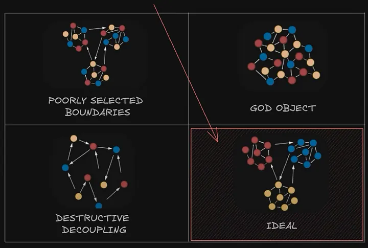
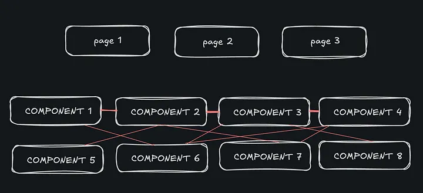
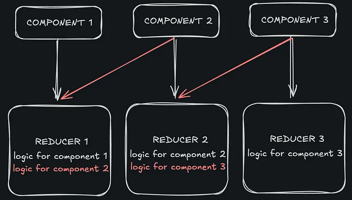
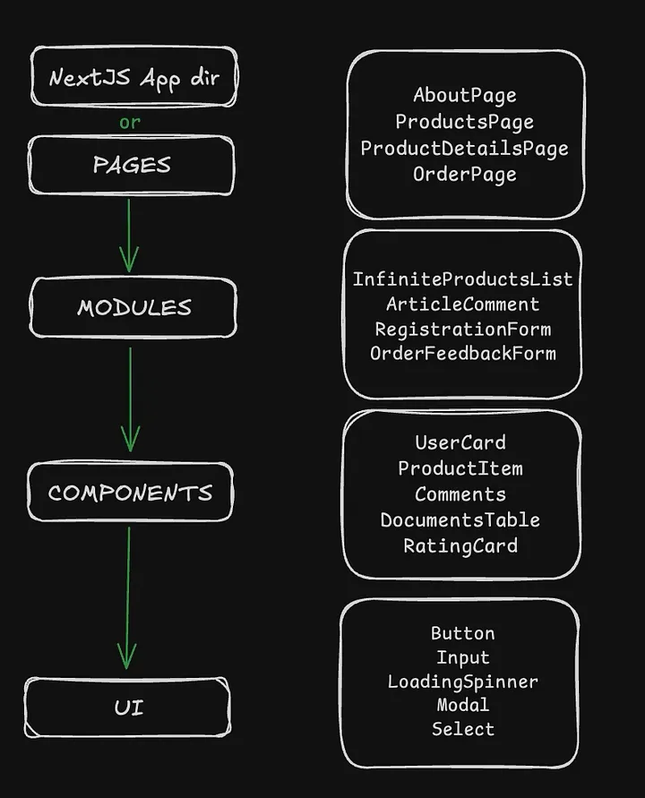
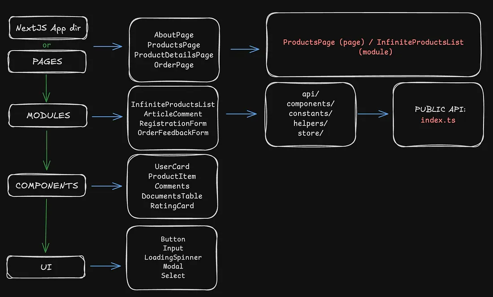
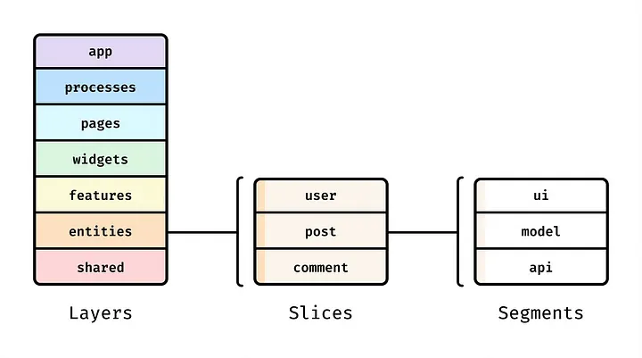

# Architectures of Modern Front-end Applications

Modern frontend applications need to be flexible, scalable, and maintainable. Let's explore different architectural approaches that can help achieve these goals.

## What's Beyond Just "Folder Structure"?

Many developers think architecture is just about organizing folders, but it's much more than that. Good architecture includes:

- **Module Communication**: How different parts of your app work together
- **Easy Navigation**: Clear organization that makes sense
- **Separated Logic**: Keeping business logic away from UI components
- **DRY Principle**: Don't Repeat Yourself
- **Divide and Conquer**: Breaking big problems into smaller ones

## Classic Architecture (No Architecture)

This is what many developers start with - simple folders like "pages", "components", and "helpers". While it works for small projects, it can become messy as your app grows.

### Problems with Classic Architecture:

- Components become too dependent on each other
- Business logic gets scattered across different files
- Hard to maintain as the project grows

This approach might work well for:

- Tiny teams (1-2 developers)
- MVP projects
- Short-term projects
- Learning projects

## Modular Architecture

Modular architecture organizes code into distinct layers:

- Pages
- Modules
- Components
- UI

Each layer can only use components from layers below it. For example:

- Pages can use modules
- Modules can use components
- Components can use UI elements
- UI is the foundation layer

Important rules:

- Modules shouldn't use other modules
- Components should keep logic simple
- Each module needs a clear public API

## Feature Sliced Design (FSD)

FSD takes modular architecture to the next level by organizing code by features instead of just layers.

Layers in FSD (from top to bottom):

1. Pages
2. Features/Widgets
3. Entities
4. Shared

Benefits of FSD:

- Clear structure
- Strong layer boundaries
- Flexible components
- Independent modules
- Better reusability

Pro tip: FSD recommends using kebab-case for file names:
